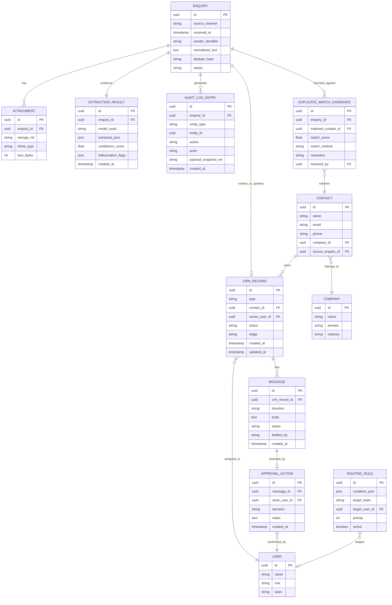

# Entity Relationship Diagram — BEDA Enquiry Intelligence Pipeline

Everything downstream of the raw enquiry is designed to be traceable back to it: every extraction, every CRM write, every message, and every human decision links back through `enquiry_id`.

## Notes on the model
- **`EXTRACTION_RESULT` is kept separate from `ENQUIRY`**, not merged into it. This preserves the raw model output (including confidence and hallucination flags) as its own auditable record, distinct from the source text — you should always be able to compare what the model said against what the customer actually wrote.
- **`DUPLICATE_MATCH_CANDIDATE` is a first-class table, not a boolean flag.** Every dedupe check against the CRM is recorded, whether or not it resulted in a merge — this is what makes duplicate handling explainable rather than a black box.
- **`MESSAGE.status`** moves through `draft → pending_approval → approved → sent` or `rejected`. No message reaches `sent` without a corresponding `APPROVAL_ACTION`.
- **`ROUTING_RULE`** is plain configuration data, editable by Ops without a code deploy — see `04-ARCHITECTURE.md` §3 for why routing is deterministic rather than LLM-driven.
