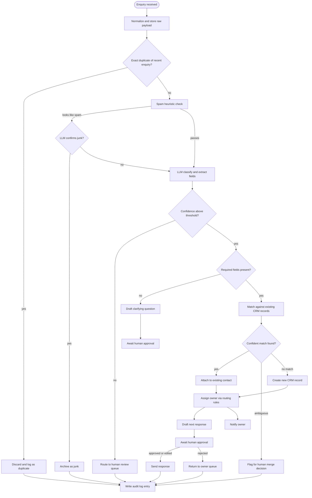
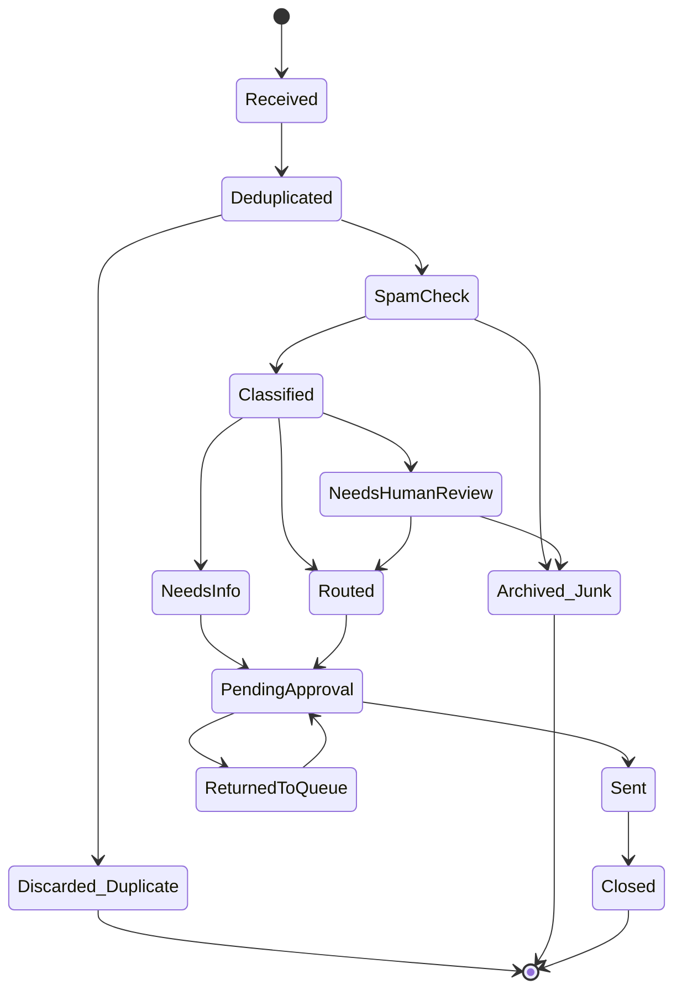

# Process Flow — BEDA Enquiry Intelligence Pipeline

## End-to-end decision flow

## Enquiry status lifecycle

## Why the flow is shaped this way
- **Cheap checks run before expensive ones.** Exact-duplicate hashing and rule-based spam heuristics run before any LLM call, so the model is only invoked on enquiries that actually need judgment — this is most of the cost control described in `04-ARCHITECTURE.md` §6.
- **Confidence gates before completeness gates.** If the model itself isn't confident in its classification, it goes to a human before the system even asks "is this enquiry complete?" — a low-confidence classification shouldn't be trusted to decide it needs more info either.
- **Every terminal path writes an audit entry**, including the "boring" ones (discarded duplicate, archived junk). Nothing exits the pipeline without a trace.
- **Two distinct approval gates exist** — one for drafted messages (`APR1`/`APR2`) and one for ambiguous duplicate merges (`S9a`). They're separate because they carry different risk: a bad draft wastes a customer's time, a bad merge corrupts the CRM.
