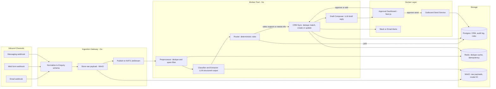

# Architecture — BEDA Enquiry Intelligence Pipeline

This document is structured to answer the eight points from the assessment brief directly, in order.

## 1. Architecture and Data Flow



**Flow in words:** a webhook lands on the Ingestion Gateway, which normalizes it into a common `Enquiry` shape, archives the raw payload to object storage (so the original is never lost even if parsing changes later), and publishes an event to a durable queue. The Gateway's only job is normalize-and-publish — it does not call an LLM and does not touch the CRM, which keeps the public-facing surface small and simple to secure.

A pool of workers consumes from the queue in stages: dedupe/spam check, then LLM classification+extraction, then a deterministic router, then CRM sync and draft composition. Every worker writes an audit event. Nothing reaches a customer or mutates a CRM record irreversibly without passing through the human approval dashboard.

Full detail on the specific flow branches is in `03-FLOW.md`; the entity/data model is in `02-ERD.md`.

## 2. Model and Tool Choices

| Component | Choice | Why |
|---|---|---|
| Backend services | Go | Strong concurrency primitives for a worker-pool/queue-consumer architecture, fast to deploy, small memory footprint per worker |
| Message queue | NATS JetStream | Durable, replayable, gives at-least-once delivery with consumer acknowledgement — needed so a crashed worker doesn't lose an enquiry mid-processing |
| Primary datastore | PostgreSQL | Relational integrity for CRM/audit data, `pg_trgm` for fuzzy name/company matching, `pgvector` available if semantic matching is needed later |
| Cache / idempotency | Redis | Fast dedupe-hash lookups and idempotency keys so retried queue messages don't double-process |
| Object storage | MinIO | Cheap, self-hostable store for raw payloads, attachments, and raw model input/output — kept separate from the relational DB because this data is large, immutable, and mainly needed for audit/replay, not queries |
| Dashboard | Next.js / TypeScript | Approval UI needs to be fast to build and iterate on; server-rendered pages are enough, no need for a heavier SPA framework here |
| LLM orchestration | langchaingo (`github.com/tmc/langchaingo`) | Go-native, and its provider abstraction (the `llms.Model` interface) lets the Classifier and Draft workers call OpenAI and Claude through the same code path — switching or falling back between providers is a config change, not a rewrite |
| LLM — Tier 1 (classification, extraction) | OpenAI, small/fast model class (e.g. GPT-4o-mini tier) | High enquiry volume needs a cheap, fast model for the mostly-mechanical job of turning free text into the structured schema in §8 |
| LLM — Tier 2 (escalation, drafting) | Claude, Sonnet-class | Used when Tier 1 confidence is low (stronger reasoning on ambiguous enquiries) and for drafting the actual customer-facing response, where writing quality matters more than raw extraction speed |

**Trade-off called out deliberately:** rather than integrating a real CRM (HubSpot/Salesforce) in v1, the system defines its own minimal CRM data model (see `02-ERD.md`). This is faster to build and fully under our control for the audit-trail requirement. The CRM Sync worker is written against a small internal interface (`FindMatch`, `CreateRecord`, `UpdateRecord`), so a real CRM's API can be substituted later without touching the rest of the pipeline.

## 3. LLM vs. Deterministic Code

| Task | LLM? | Reasoning |
|---|---|---|
| Enquiry type classification | **Yes** | Unstructured language, genuine judgment call |
| Field extraction (name, company, contact, intent) | **Yes** | Free text to structured data requires language understanding |
| Drafting the next response | **Yes** | Needs natural, context-aware language |
| Obvious junk/spam filtering | **No** (rules first) | Most junk is detectable by heuristics (empty body, known bad domains, no content signal) — reserve the LLM call for the ambiguous remainder |
| Deduplication / entity matching | **No** | Must be explainable, cheap, and consistent — done via hash matching plus `pg_trgm` fuzzy matching, not model judgment |
| Routing to owner/team | **No** | Business policy should be transparent and editable by Ops without touching model prompts |
| CRM record create/update | **No** | The LLM *proposes* structured data; deterministic code *validates and writes* it. The model never has direct write access |
| Sending a message | **No** | Strictly triggered by a human clicking approve — this is the core consequential action the brief asks us not to automate |
| Merging or deleting CRM records | **No** | Always a human decision — see §7 |

The general rule: **the LLM is used exactly where language understanding is genuinely required, and nowhere else.** Everything that can be expressed as a rule, a threshold, or a lookup is plain code, because plain code is cheaper, faster, and — critically for this brief — auditable and predictable in a way a model call isn't.

## 4. Incomplete Information, Hallucination, Duplicates, and Failures

**Incomplete information**
The extraction schema (see §8) has an explicit `missing_fields` array rather than letting the model silently fill gaps. If required fields for a sales/support record aren't present, the system drafts a clarifying question instead of creating a half-populated CRM record — the draft still requires human approval before it's sent, so a human always makes the final call on whether the question is even the right one to ask.

**Hallucination**
Three layers, none of which rely on trusting the model:
1. **Structured output only.** The model returns JSON against a fixed schema (function/tool calling), not free text that gets regex-parsed — this alone removes most of the surface area for silent errors.
2. **Grounding check.** Every extracted field is required to include a verbatim supporting quote from the source text. Deterministic code checks that quote actually appears (substring match) in the normalized enquiry text; if it doesn't, that field is flagged `unverified` and excluded from automatic CRM writes.
3. **Nothing the model outputs is trusted for irreversible actions.** The model's confidence score plus the grounding check together decide whether an item is auto-processed or routed to a human — a "confident-sounding" hallucination still has to pass the grounding check to be acted on.

**Duplicates**
Two separate mechanisms, deliberately kept apart:
- *Exact/near-exact duplicate enquiries* (the same message twice) are caught before any LLM call, via a hash of sender + normalized body content in Redis with a short TTL — cheap, deterministic, catches retries and accidental double-submits.
- *CRM entity matching* (is this contact already in the system) is fuzzy: normalized email/phone exact match first, then `pg_trgm` similarity on name/company as a fallback. High-confidence matches auto-attach; medium-confidence matches are logged as a `DuplicateMatchCandidate` and go to a human; nothing is auto-merged.

**Model or API failure**
- Because Tier 1 (OpenAI) and Tier 2 (Claude) both sit behind the same `llms.Model` interface via langchaingo, a failing call on one provider falls over to the other before the retry budget is spent — cheaper and faster than retrying a provider that may be down, and it means a single vendor outage doesn't stall the pipeline.
- Retries with exponential backoff and a circuit breaker per worker stage.
- After retries are exhausted, the enquiry doesn't get dropped — it's marked `NeedsHumanReview` and moved to a dead-letter subject in JetStream, with an alert to Ops.
- Every queue message carries an idempotency key so a retried/redelivered message can't create a second CRM record or send a second draft for the same enquiry.

## 5. Permissions, Secrets, and Sensitive Data

- **Least privilege by component.** The Ingestion Gateway can only publish to the queue — it has no CRM credentials and no LLM API key. Only the CRM Sync worker holds CRM write credentials; only the Classifier/Draft workers hold the LLM API key.
- **Secrets management.** Credentials live in a secrets manager/vault, injected at runtime, never committed or logged. Rotated on a schedule.
- **Data minimization before the LLM call.** Payment details, government ID numbers, and similar sensitive fields are stripped/redacted from the enquiry text before it's sent to the model, unless the specific task genuinely requires them.
- **Encryption.** TLS in transit everywhere; encryption at rest for Postgres and MinIO.
- **Role-based access on the dashboard.** Sales reps see their queue, support agents see theirs, Ops/Admin sees everything and configures routing rules. The audit log records who approved or rejected what, not just that "the system" acted.
- **Vendor data handling.** If a third-party LLM API is used, confirm the data processing terms (no training on submitted data) given this is customer business communication — flag this explicitly as a procurement/legal question, not something to assume.

## 6. Cost and Latency Control

| Tier | Used for | Cost profile |
|---|---|---|
| Tier 0 — rules only | Exact duplicates, obvious spam | Free, instant |
| Tier 1 — OpenAI (small/fast model) | First-pass classification + extraction for the large majority of enquiries | Fast, low cost, structured output |
| Tier 2 — Claude (stronger model) | Tier-1 results below the confidence threshold, unusually long threads, high-value enquiries, and all response drafting | Slower and costlier, used deliberately, not by default |

Additional controls:
- **Async by default.** The webhook returns an acknowledgment immediately; all processing happens off the queue. Nothing about ingestion latency depends on LLM latency.
- **Redis caching** avoids reprocessing near-identical resubmissions.
- **Context trimming.** Long email threads are truncated to the latest message plus a short summary of prior context rather than resending the full thread on every call.
- **Batching where SLA allows.** Non-urgent channels (e.g. a low-priority web form) can be processed in small batches rather than strictly per-message if volume grows, without changing the pipeline shape.
- **Cost-per-enquiry is a tracked metric** (see PRD §7), with budget alerts — cost control here is a monitored property of the system, not a one-time design decision.

## 7. One Thing Deliberately Not Automated

**Sending any outbound customer-facing message, and any destructive or consequential CRM mutation (merge, delete, mark-as-lost, discount/pricing commitment) — none of these ever happen without an explicit human click, regardless of model confidence.**

Reasoning: a model's confidence score is not a calibrated probability of correctness — a hallucination doesn't announce itself with low confidence. A wrong send can't be unsent and can damage a real business relationship; a wrong merge can silently corrupt the CRM in a way that's hard to notice and expensive to unwind. The cost of requiring approval is a few minutes of async latency. The cost of not requiring it is unbounded. This is the direct implementation of the brief's constraint that the system "must not autonomously take consequential actions when human approval is appropriate."

## 8. Pseudocode and Configuration

**Extraction output schema** (enforced via structured/tool-call output, not free text):

```json
{
  "type": "object",
  "properties": {
    "enquiry_type": { "enum": ["sales", "support", "junk", "insufficient_info"] },
    "confidence": { "type": "number", "minimum": 0, "maximum": 1 },
    "urgency": { "enum": ["low", "medium", "high"] },
    "intent_summary": { "type": "string" },
    "contact": {
      "type": "object",
      "properties": {
        "name": { "type": ["string", "null"] },
        "email": { "type": ["string", "null"] },
        "phone": { "type": ["string", "null"] },
        "company_name": { "type": ["string", "null"] }
      }
    },
    "missing_fields": { "type": "array", "items": { "type": "string" } },
    "grounding_quotes": {
      "type": "object",
      "description": "verbatim source-text spans supporting each extracted field, checked by code before any field is trusted",
      "additionalProperties": { "type": "string" }
    }
  },
  "required": ["enquiry_type", "confidence", "urgency", "intent_summary", "missing_fields"]
}
```

**Routing rules as configuration** (editable by Ops, no deploy needed):

```yaml
confidence_threshold: 0.72
auto_attach_match_threshold: 0.95   # still attaches, never auto-merges

routing_rules:
  - id: high-value-sales
    when: { enquiry_type: sales, urgency: high }
    target_team: enterprise-sales
    priority: 1
  - id: general-sales
    when: { enquiry_type: sales }
    target_team: sales-inbound
    priority: 10
  - id: support-default
    when: { enquiry_type: support }
    target_team: support-l1
    priority: 10
```

**LLM call layer — langchaingo with OpenAI + Claude (Go pseudocode):**

Both providers implement the same `llms.Model` interface, so the extraction call, the confidence-based escalation, and the failure fallback are all just "call a different `llms.Model` value" — no provider-specific branching in the worker logic itself.

```go
package extract

import (
    "context"
    "fmt"

    "github.com/tmc/langchaingo/llms"
    "github.com/tmc/langchaingo/llms/anthropic"
    "github.com/tmc/langchaingo/llms/openai"
)

type Extractor struct {
    tier1 llms.Model // OpenAI — fast, cheap, first pass
    tier2 llms.Model // Claude — escalation + drafting
}

func NewExtractor(cfg Config) (*Extractor, error) {
    tier1, err := openai.New(openai.WithModel(cfg.OpenAIModel))
    if err != nil {
        return nil, fmt.Errorf("openai client: %w", err)
    }
    tier2, err := anthropic.New(anthropic.WithModel(cfg.ClaudeModel))
    if err != nil {
        return nil, fmt.Errorf("anthropic client: %w", err)
    }
    return &Extractor{tier1: tier1, tier2: tier2}, nil
}

// Extract runs the structured-output schema against Tier 1, escalates to
// Tier 2 on low confidence, and falls back to Tier 2 on a Tier 1 failure.
func (e *Extractor) Extract(ctx context.Context, enquiryText string) (ExtractionResult, error) {
    result, err := e.call(ctx, e.tier1, enquiryText)
    if err != nil {
        result, err = e.call(ctx, e.tier2, enquiryText) // provider fallback, not just a retry
        if err != nil {
            return ExtractionResult{}, fmt.Errorf("both providers failed: %w", err)
        }
        return result, nil
    }
    if result.Confidence < cfg.ConfidenceThreshold {
        if escalated, err := e.call(ctx, e.tier2, enquiryText); err == nil {
            return escalated, nil
        }
        // escalation failed — keep the tier-1 result; the confidence gate
        // in RouteEnquiry below will still send it to human review
    }
    return result, nil
}

func (e *Extractor) call(ctx context.Context, model llms.Model, text string) (ExtractionResult, error) {
    resp, err := model.GenerateContent(ctx,
        []llms.MessageContent{
            llms.TextParts(llms.ChatMessageTypeSystem, extractionSystemPrompt),
            llms.TextParts(llms.ChatMessageTypeHuman, text),
        },
        llms.WithTools([]llms.Tool{extractionSchemaTool}), // built from the JSON schema above
    )
    if err != nil {
        return ExtractionResult{}, err
    }
    return parseAndVerifyToolCall(resp, text) // enforces the grounding-quote check from §4
}
```

*(Illustrative — verify exact option names like `WithModel` against the current langchaingo docs when Claude Code implements this; the library moves quickly.)*

**Routing decision (Go pseudocode):**

```go
func RouteEnquiry(ex ExtractionResult, dup *DuplicateMatch, rules []RoutingRule) Decision {
    if ex.Confidence < cfg.ConfidenceThreshold {
        return Decision{Action: NeedsHumanReview, Reason: "low_confidence"}
    }
    if ex.EnquiryType == "junk" {
        return Decision{Action: ArchiveJunk, RequiresApproval: false}
    }
    if len(ex.MissingFields) > 0 && ex.EnquiryType != "junk" {
        return Decision{Action: DraftClarifyingQuestion, RequiresApproval: true}
    }
    if dup != nil && dup.Score >= cfg.AutoAttachMatchThreshold {
        // attach only — merging remains a human decision regardless of score
        return Decision{Action: AttachToExistingContact, ContactID: dup.ContactID}
    }
    if dup != nil {
        return Decision{Action: FlagForHumanMergeReview, CandidateID: dup.ID}
    }
    for _, r := range sortByPriority(rules) {
        if r.Matches(ex) {
            return Decision{
                Action:          CreateOrUpdateCRM,
                Team:            r.TargetTeam,
                DraftResponse:   true,
                RequiresApproval: true, // the *draft* still needs a human to approve sending it
            }
        }
    }
    return Decision{Action: NeedsHumanReview, Reason: "no_matching_rule"}
}
```

## Build Sequencing for Claude Code

A practical build order for turning this into a working prototype:

1. **Data model first.** Scaffold the Postgres schema from `02-ERD.md`, get basic CRUD and the audit log table working against fixture data — no LLM, no queue yet.
2. **Deterministic router.** Build `RouteEnquiry` and the rules-engine config loader, and unit-test it against hand-written `ExtractionResult` fixtures. This is the part of the system that most needs to be correct and is easiest to get right in isolation.
3. **Wire the pipeline with a stub classifier.** Stand up the Ingestion Gateway, NATS JetStream, and the worker pool, but have the Classifier worker return a fixed canned response — this proves the end-to-end plumbing before any model cost is involved.
4. **Swap in the real LLM call** using the JSON schema above, add the confidence gate and grounding check.
5. **Build the approval dashboard last**, once there's real pipeline output to review — it's much easier to design a UI against real data shapes than imagined ones.
6. **Add observability/audit views** once the happy path works end to end.
